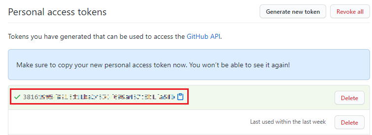

# Top-Langauges - Readme


Add development language usage statistics on your Profile Readme.

Did not need to fork this repository.

## Usage

1. Go to your Profile Readme

1. move to `<username>/<username>/actions`

1. Click New workflow

1. Set up a workflow yourself

1. Delete the default content

1. copy the following code and paste it to your new workflow

    ```yml
    name: Top-Languages Readme

    on:
        workflow_dispatch:
        schedule:
            # Runs at 12am UTC
            - cron: '0 0 * * *'

    jobs:
        update-readme:
            name: Update this repo's README
            runs-on: ubuntu-latest
            steps:
            - uses: ryuanerin/top-languages-readme@master
    ```

1. Add a comment to your README.md like this:

    ```md
    <!--START_SECTION:top_language-->
    <!--END_SECTION:top_language-->
    ```

1. Go to Action menu

1. Click `Top-Languages Readme` under `All workflows`

1. Click `Run workflow`

## Including private repository

1. Move to [**Github Settings -> Developer settings -> Personal access tokens** -> Generate new token](https://github.com/settings/tokens/new)

1. Check **repo**

1. Click `generate token`

1. Copy `token`

    

1. Go to your Profile Readme

1. Move to `Settings` -> `Secrets`

1. Click `New Secret`

1. input `GH_TOKEN` in **Name**

1. input the copied token in **Value**

1. Click `Add secret`

1. Edit you workflow file

    ```yml
    name: Top-Languages Readme

    on:
        workflow_dispatch:
        schedule:
            # Runs at 12am UTC
            - cron: '0 0 * * *'

    jobs:
        update-readme:
            name: Update this repo's README
            runs-on: ubuntu-latest
            steps:
            - uses: ryuanerin/top-languages-readme@master
              with:
                GH_TOKEN: ${{ secrets.GH_TOKEN }}
    ```

## With option (Optional)

```yml
name: Top-Languages Readme

on:
    workflow_dispatch:
    schedule:
        # Runs at 12am UTC
        - cron: '0 0 * * *'

jobs:
    update-readme:
        name: Update this repo's README
        runs-on: ubuntu-latest
        steps:
        - uses: ryuanerin/top-languages-readme@master
          with:
            USERNAME: <username> # Optional
            COMMIT_MESSAGE: "Updated the Graph with new Metrics"    # Optional
            DONE_BLOCK:  "█" # Optional
            EMPTY_BLOCK: "░" # Optional
            LIST_COUNT:  10  # Optional
```

- default option

    ```txt
    C#                   3.61 MiB ███████████░░░░░░░░░░░░░  44.38 %
    JavaScript           1.01 MiB ███░░░░░░░░░░░░░░░░░░░░░  12.35 %
    Go                 973.63 KiB ███░░░░░░░░░░░░░░░░░░░░░  11.69 %
    CSS                739.71 KiB ██░░░░░░░░░░░░░░░░░░░░░░   8.88 %
    HTML               637.18 KiB ██░░░░░░░░░░░░░░░░░░░░░░   7.65 %
    Java               522.66 KiB █░░░░░░░░░░░░░░░░░░░░░░░   6.27 %
    Python             257.42 KiB ░░░░░░░░░░░░░░░░░░░░░░░░   3.09 %
    C++                204.07 KiB ░░░░░░░░░░░░░░░░░░░░░░░░   2.45 %
    PHP                149.97 KiB ░░░░░░░░░░░░░░░░░░░░░░░░   1.80 %
    Jupyter Notebook    61.82 KiB ░░░░░░░░░░░░░░░░░░░░░░░░   0.74 %
    ```

- if set EMPTY_BLOCK to '` `'

    ```txt
    C#                   3.61 MiB ███████████               44.38 %
    JavaScript           1.01 MiB ███                       12.35 %
    Go                 973.63 KiB ███                       11.69 %
    CSS                739.71 KiB ██                         8.88 %
    HTML               637.18 KiB ██                         7.65 %
    Java               522.66 KiB █                          6.27 %
    Python             257.42 KiB                            3.09 %
    C++                204.07 KiB                            2.45 %
    PHP                149.97 KiB                            1.80 %
    Jupyter Notebook    61.82 KiB                            0.74 %
    ```
