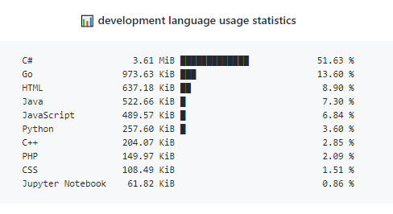

# Top-langauges - README



Add development language usage statistics on your Profile Readme:

## Usage

1. Go to your Profile Readme

1. move to `<username>/<username>/actions`

1. Click New workflow

1. Set up a workflow yourself

1. Delete the default content

1. copy the following code and paste it to your new workflow

    ```yml
    name: Top-Languages Readme

    on:
        workflow_dispatch:
        schedule:
            # Runs at 12am UTC
            - cron: '0 0 * * *'

    jobs:
        update-readme:
            name: Update this repo's README
            runs-on: ubuntu-latest
            steps:
            - uses: ryuanerin/top-languages-readme@master
    ```

1. Add a comment to your README.md like this:

    ```md
    <!--START_SECTION:top_language-->
    <!--END_SECTION:top_language-->
    ```

1. Go to Action menu

1. Click `Top-Languages Readme` under `All workflows`

1. Click `Run workflow`

## With option (Optional)

```yml
name: Top-Languages Readme

on:
    workflow_dispatch:
    schedule:
        # Runs at 12am UTC
        - cron: '0 0 * * *'

jobs:
    update-readme:
        name: Update this repo's README
        runs-on: ubuntu-latest
        steps:
        - uses: ryuanerin/top-languages-readme@master
          with:
            USERNAME: <username> # Optional
            COMMIT_MESSAGE: "Updated the Graph with new Metrics"    # Optional
            DONE_BLOCK:  "█" # Optional
            EMPTY_BLOCK: "░" # Optional
            LIST_COUNT:  10  # Optional
```

- default option
    ```txt
    C#           3,057,137 lines ███████████████████░░░░░   76.48 %
    Go             345,629 lines ██░░░░░░░░░░░░░░░░░░░░░░    8.65 %
    HTML           262,342 lines █░░░░░░░░░░░░░░░░░░░░░░░    6.56 %
    C++            145,060 lines █░░░░░░░░░░░░░░░░░░░░░░░    3.63 %
    JavaScript     106,744 lines ░░░░░░░░░░░░░░░░░░░░░░░░    2.67 %
    CSS             42,778 lines ░░░░░░░░░░░░░░░░░░░░░░░░    1.07 %
    Python          11,716 lines ░░░░░░░░░░░░░░░░░░░░░░░░    0.29 %
    Shell            8,387 lines ░░░░░░░░░░░░░░░░░░░░░░░░    0.21 %
    TypeScript       7,976 lines ░░░░░░░░░░░░░░░░░░░░░░░░    0.20 %
    C                4,356 lines ░░░░░░░░░░░░░░░░░░░░░░░░    0.11 %
    ```

- if set EMPTY_BLOCK to ' '

    ```txt
    C#           3,057,137 lines ███████████████████       76.48 %
    Go             345,629 lines ██                         8.65 %
    HTML           262,342 lines █                          6.56 %
    C++            145,060 lines █                          3.63 %
    JavaScript     106,744 lines                            2.67 %
    CSS             42,778 lines                            1.07 %
    Python          11,716 lines                            0.29 %
    Shell            8,387 lines                            0.21 %
    TypeScript       7,976 lines                            0.20 %
    C                4,356 lines                            0.11 %
    ```